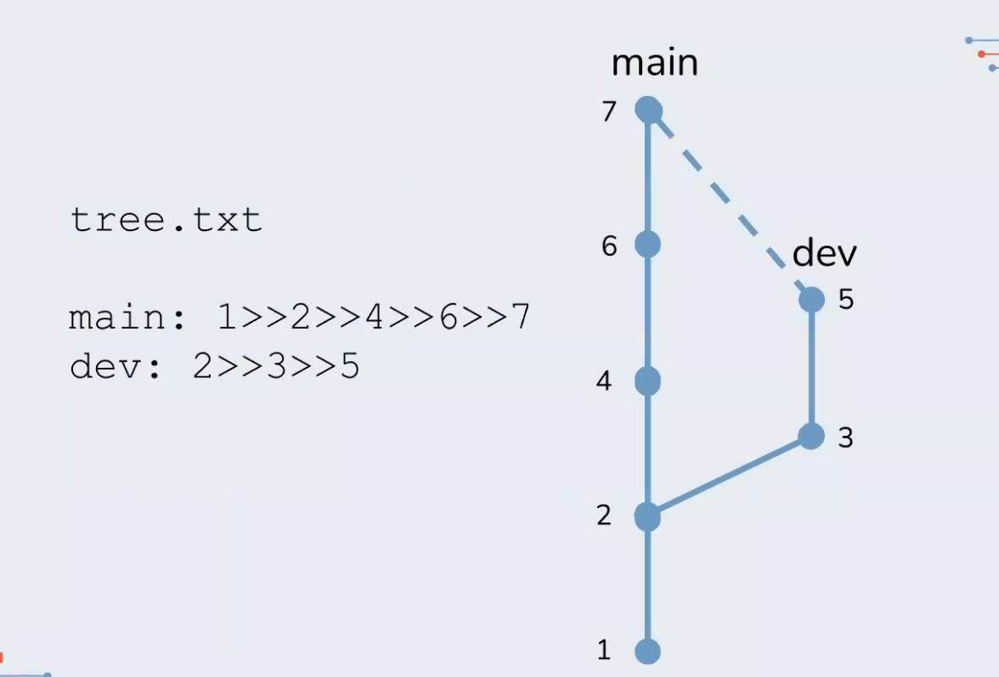

# Think like Git

## Checkpoints
* files (blobs) stored as hashes
* folder structure and commits stored as tree. Trees are like directories. Tree can be in a tree
* all objects (files, commits, trees) stored in .git/objects
* branches stored as hash, representing most recent commit in branch (HEAD) in .git/refs/heads
* Traverse tree history by looking at parent commit hash

## What's in a commit?
* tree + hash
* parent + hash
* author
* committer

## How do merges work?
1. At tree level: Compare everything in the two trees:
    * Accept any new files from either tree
    * For files with same name, accept if hashes match
    * Otherwise, dive into the file to resolve
2. At file level: compare everythng in the two files:
    * find most recent common ancestor (parent hash) of the file
    * accept any unique changes from either file
    * otherwise, raise a merge conflict for user to resolve

## Fetches and Remotes
* `git fetch` is functionally identical to your coworker emailing you their .git folder
* Github is just like any other working copy - just a nice UI on top of git CLI

## Hot tips
* Git only cares about the .git folder
* Local changes don't affect your git history
* Nothing in your local version (working copy) exists until commit
    * uncommited changes follow you from branch to branch
* Always run `git status` before you commit/checkout
* Commit branch-specific changes **before switching branches**
* When you hit an error, look at it from git's perspective
    * what is in `.git`?
    * what is in my working copy?
    * if errors with `pull` or `fetch`, how is my remote different to local?