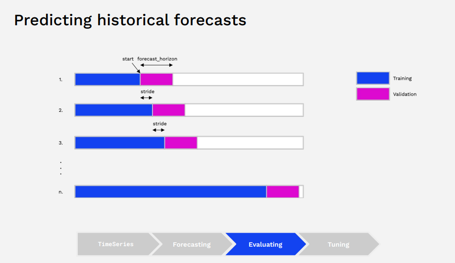

# Darts for Time Series Forecasting

https://github.com/unit8co/darts/blob/master/examples/01-darts-intro.ipynb

`pip install darts`

## Time series forecasting
* constant time space between attribute values - projection beyond current time
`future = f(history + external data)`
* consideration - do we have a valuable signal in the data?

## Darts
* Darts is a Python library for easy manipulation and forecasting of time series
* This presentation focussing on the forecasting part 
* Immutable `Timeseries` Class as basic building block
* Unified `fit(), predict()` interface
* classic + state of the art ML models
* user friendly API and reasonable defaults
* does more than just forecasting: discovery, preprocessing, model evaluation and selection

## Forecasting with Darts
* Wide range of models to choose from, with good enough defaults to start wtih
    * Exponential smoothing
    * Theta
```python
from darts.models import TimeSeries, Tehta, ExponentialSmoothing

# Load
series = Timeseries.from_csv('monthly-milk.csv', time_col = 'Month')
# Vis
series.plot()
# Split
training, validation = series.split_after(0.8)
# Fit
model = Theta()
model.fit(training)
pred = model.predict(len(validation)) # number of timestamps that we want to predict
# Evaluate
from darts.metrics import mape, mase
score = mape(validation, pred)
score - mase(validation, pred, training) # mean absolute scaled error
```
* Avoiding overfitting - evaluationg model performance
    * cross validation is tricky
    * use `historical_forecasts()` and `backtest()` to simulate how the model would have performed if it had been historically used to forecast a series
    

    ```python
    historical_forecast = model.historical_forecasts(
        series=series,
        start=0.5,
        forecast_horizon=12
    )
    # Hyperparameter tuning
    params = {
        'theta': [0.5, 1, 1.5, 2, 2.5],
        'season_mode': [SeasonalityMode.MULTIPLICATIVE,
                        SeasonalityMode.ADDITIVE]    
    }
    best_model, best_params = Theta.gridsearch(
        parameters=params,
        series=training, #excludes validation set - like cross val
        start=0.5,
        forecast_horizon=12
    )
    ```

## More advanced functionality
* Classical ML and Deep Learning 
* Support for multi-dimensional series
* Train models on mutltiple time series
    * N-BEATS model (meta-learning). Enables zero-shot forecasting, applying to a series never seen before
* Include external past and future data
    * Define Target series (to be forecast), Past Covariates, Future Covariates
    * `fit() and predict()` can accpept `past_covariates` and/or `future_covariates`. If `future_covariates` are given, future value will be required at inference time
    * alignment of covariates with target is automatic
* Probabilistic forecasting
    * Confidence intervals for forecasts - capturing series stochasticity
        * captures previously seen noise
        * ARIMA models
        * TCNModels
        ```python
        model = TCNModel(likelihood=GaussianLikelihood(),
                         **kwargs)
        model.fit(train, past_covariates=noise_intensity)
        pred = model.predict(n, 
                             past_covariates=noise_intensity,
                             num_samples=100)
        ```
    * Probabilistic forecasts predict the parameters of distribution of predictions `from darts.utils.likelihood_models import (...)`
        * able to specify prior values for parameters

* Time Series are actually 3D data
    1. Time
    2. Components
    3. Samples - stochastic series

