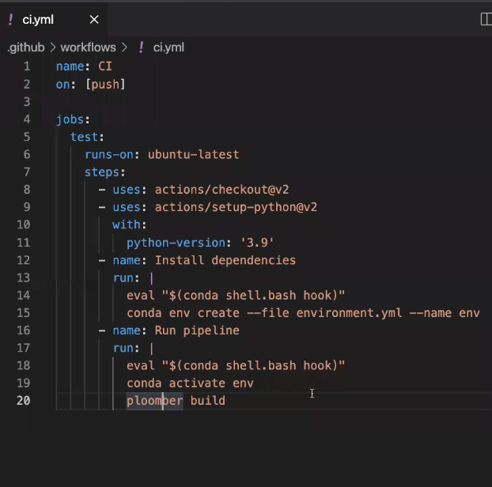
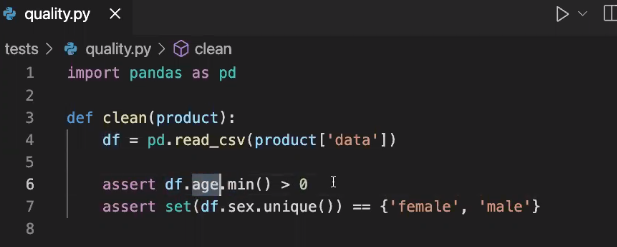
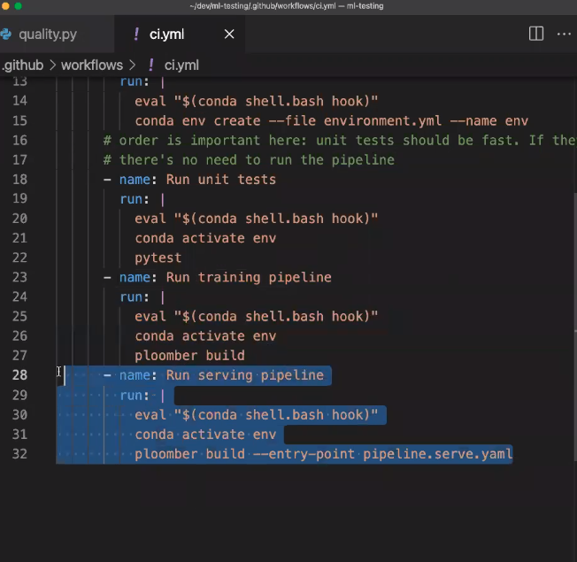
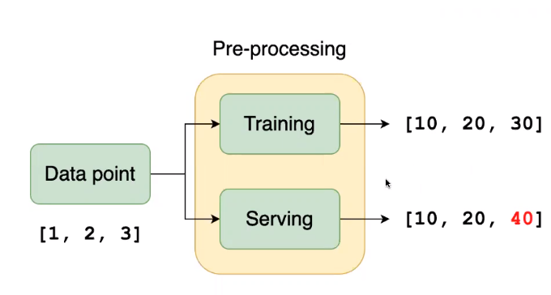
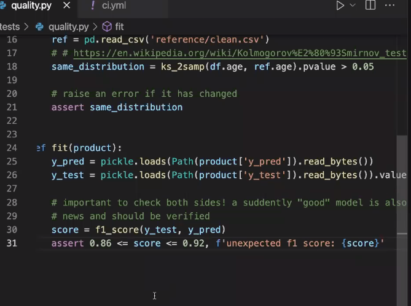

# Effective Testing for ML projects

A framework for testing ML projects

https://github.com/edublancas/ml-testing
* uses Github actions to run tests upon push and `ploomber` framework
* https://github.com/ploomber/ploomber

## Motivation
* Would you rather catch bugs in development in development or production?
* Strike a good balance that allows you to experiment fast, with confidence - want a robust experimentation pipeline
* test continuously with each change - early, even with ML pipeline in notebook
* all checks below are designed to be run continuously , before deployment

## Leve1 1: Smoke testing 
* ensure that our code runs
* `git checkout 1-smoke-testing`
* tip: test with a random sample


## Level 2: Integration (data quality) and unit testing 
* Prevent poor quality data from entering training pipeline
* Detect bugs in data transformations
* `git checkout 2-integration-and-unit`

* When should I write a unit tests? Any custom transformations
* Consider running integration tests on samples or nightly/weekly

## Level 3: Variable distributions and inference pipeline
* Detect changes in data distribution
* Ensure we can use our model to predict - test our inference pipeline
* `git checkout 3-distribution-and-inference`

* example of data distribution check with scipy
```python
from scipy.stats import ks_2samp

new_data = pd.read_csv('new_data.csv')
ref = pd.read_csv('reference/clean.csv')
threshold = 0.05

# check if age distribution is the same
same_distribution = ks_2samp(new_data.age, ref.age).pvalue > threshold

# raise an error if it moved beyond threshold
assert same_distribution
```

## Level 4: Training transformation pipeline equivalent to Inference pipeline (in particular, features)
* ensure processing consistency at training and inference time, for the same sample
* `git checkout 4-train-serve-skew`


## Level 5: Model quality 
* Ensure quality of training pipeline
* Idea is that some measure of model performance on test set should not move drastically from some pre-defined range
* `git checkout 5-model-quality`
