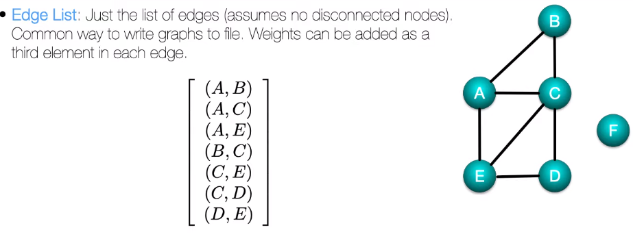

# Graphs for Data Science wtih NetworkX

* https://github.com/DataForScience/PyData2021
* Graphs for Data Science https://graphs4sci.substack.com/
* Vizualization for Data Science https://viz4sci.substack.com/

## What is a graph
* Networks vs Graphs - interchangeable. "network" preferred by Physicists/Engineers, "graph" more common among Mathematitians
* Important terms


## Graph representations
* **Edge list**: list of edges as tuples (assumes no disconnected nodes. Disconnected nodes are excluded). Tuples can be extended with 3rd element, weight

* **Adjacency matrix**: matrix containing non-zero elements for edges that are present (value = 1 for non-weighted, !=1 for weighted)

* **Adjacency List/Dict**: list of all nodes a given node is connected to (empty list for disconnected nodes)


## Degrees
* most fundamental property of a node is its degree, `k` - number of connections of a node
* for Directed Networks, have `in-degree` and `out-degree`
* Degree Sequence - ordered sequence of degree of each node
* Degree Distribution - relative frequency of each degree value
    * well known types: Poissonion (nodes have very similar number of connections), Gassuian, Power-Law (e.g. 80% of wealth owned by 20% - most nodes have few connections, some nodes have lots)

* Degree Correlation - conditionaal probability that a node with degree `k` is connected to a node of degree `k'` - with this, we can calculate the average degree of the nearest neighbours of a node with degree `k`

    * Associative: nodes with high (low) degree tend to have nearest neighbours with high (low) degree
        * Associativity coefficient (Pearson) positive
    * Disassociative: nodes with higher degree tend to have nearest neighbours with low degrees (e.g. airport hubs)
        * Associative coefficient negative

## Edge WEight
* connection strenght/frequency/distance...
* Node strength = weighted degrees, based on in/out weights

## Shortest path and Distances
* minimum number of hops between two give nodes
* algorithms to identify and measure shortest distance:

### Depth First Search: 
* keep going until you hit a dead-end then backtrack - will visit every node
* typically used in un-weighted graphs

### Bredth first search
* explore all the local neighbours first
* typically used in un-weighted graphs

### Dijkstra's Algorithm
* keep extending the curent shortest path
* assumes weighted graph. weights must be positive, else can cause infinite loops
* for unweighte graphs, becomes Bredth First Search
* at each step, find node `i` with smallest current distance to origin 
* can be slow

## OpenStreetMap data and `osmnx`
* see "..\graph_ds\networkx_workshop\PyData2021\2. Searching in Graphs.ipynb"
* `osmnx` package can easily download OpenStreetMap data , using Geopandas, NetworkX and matplotlib
* e.g. driving network for a region: 
```python
import osmnx as ox

place = "Manhattan, NY, USA"
G_roads = ox.graph_from_place(place, network_type='drive')

# returns a NetworkX object with simple interface to manipulate graph
```
## Components
* see "..\graph_ds\networkx_workshop\PyData2021\3. Graph Connectivity.ipynb"
* it is possible to have disconnected nodes as well as larger disconnectived parts of the network. Each piece is a **Component**
* Graphs with a single componenta aare called **Connected**
* In directed graphs: 
    * Strongly connected components: every node is reachable by following direction of edges
    * Weakly connected components: every node is reachable but disregarding direction of edges

## Random Graphs    
* see "..\graph_ds\networkx_workshop\PyData2021\4. Social Networks.ipynb"
* Poisson/Gaussian degree distribution - all nodes have similar degrees > No Hubs
* start with `N` disconnected nodes
* connect each pair of nodes with probability `p <<1`

## Clustering Coefficient
* amount of connectivity between nearest neighbours
* e.g. how likely are the frields of my frields to know each other?

* take the average coefficient across all nodes

## Network Diameter
* e.g. any two people in US are connected by 6 degrees of separation

## Wats-Strogatz model
