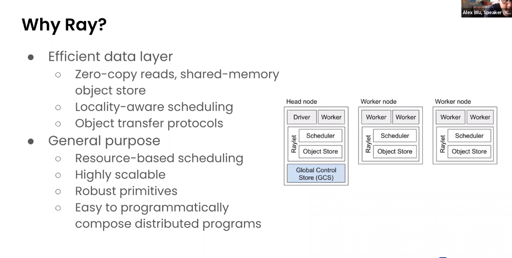

# Unifying Data preprocessing and training with Ray Datasets

* https://docs.ray.io/en/master/data/dataset.html#
* https://github.com/ray-project/ray

* Powered by Apache Arrow
* Universal data loader, last-mile transformations and integration with ML libraries
* Does not replace Dask/Spark

## Existing challenges
* Existing ML pipelines preprocessing using Spark/Dask/Pandas, save to S3 then read and train in new job.
    * Perhaps orchestrated via various tools like Kubeflow or Airflow 
* Serialisation/Deserialisation has performance overhead
* Materialisation of data to storage is really only done to minimse duplicate computation 

## Ray Datasets - solving some challenges
* implemented in C++

* Not a general purpose data frame library - more for last-mile pre-processing to convert into model inputs, which can then be passed directly to model algorithm APIs

* can be converted to and from Pandas/Dask data frames

### Last-mile preprocessing
* map, batch map, filter, stats aggregations
* sort, random shuffle, groupby

## Use cases that Ray Datasets excels at

### Scaleable shuffled ingest for ML training process
* loading data from storage, partition into shards (if partitioned training), batching into GPU batches, shuffling before each epoch of model training process 
    * shuffling before each epoch improves model performance and regularisation

* examples of optimised use cases including global shuffle:
1. Pandas >> S3 >> Petastorm (Uber ML ingest library) >> Horovod
    * Ray's solution: Dask-on-Ray >> Datasets >> Horovod
2. S3 >> Petastorm >> Horovod
    * Ray's solution: S3 >> Datasets >> Horovod    
3. Batch inference: Pandas >> Torch
    * Ray: Dask-on-Ray >> Ray Datasets >> Torch