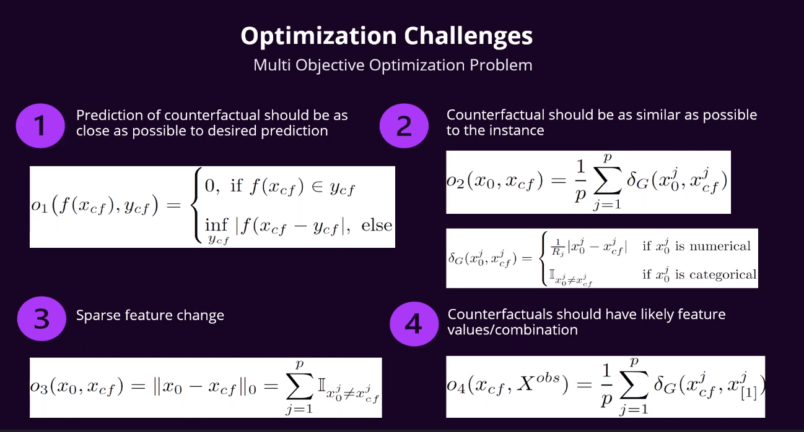

# Counter factual analysis for Explainable AI

Showed implementation of `dice-ml` package with Dask UI on proprietary product
* `dice-ml` microsoft Python library: Diverse Counterfactual Explanations for tabular data  https://github.com/interpretml/DiCE
* `alibi` mentioned for image counterfactuals

## Definition of counterfactual explanation
* Describes the smallest change to the feature values that change the prediction to a predefined output - hypothical reality, e.g. what feature values will change prediction from "decline" to "approve"
* Desireable to be an "actionable" counterfactual e.g. small number of realistic feature changes, feature values which are likely, avoid contradictions, not too many features to change

## Optimisation problem to finding counter factuals
* multiple objectives

* multiple algorithms to achieve    
    * base method
    * multi-objective counter factuals
    * Diverse Counterfactual Explanations (DiCE)
        * optimise objectives 1 and 2
    * Interpretable CFs guided by prototypes (evolving)
        * model agnostic
        * more interpretable counterfactuals
        * tries to optimise objectives 1, 2, 3
        * fast
        * works for tabular and image data

## Notion of counterfactual fairness
* Intuition: model outcome is fair if prediction / decision is the same under different counterfactuals, where the features changed are sensitive attributes

