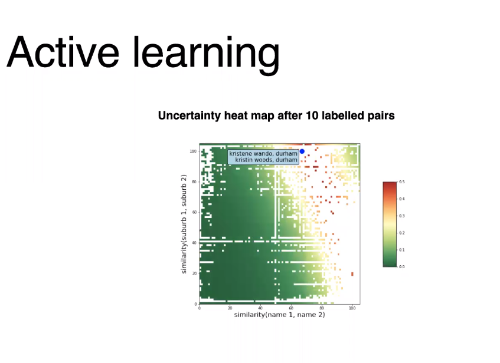
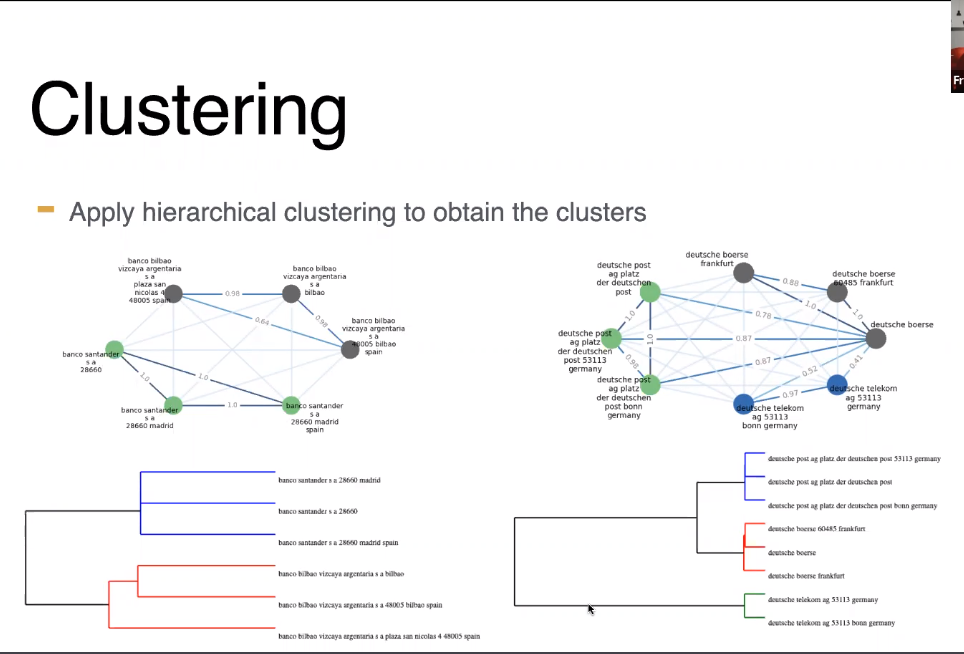

# DedupliPy: a new deduplication package

Package that identifies deuplicate tablular records by training a model instance that can be used to predict on new data

`pip install deduplipy`

https://www.deduplipy.com/

## Deduplication == Entity resolution
 * identify single real world entity from multiple entities

 ## Challenges
 * how to comparing strings
    * Levenshtein edit distance. BUT distance can be smaller for a different entity than for different notation of same entity, e.g. Airbus vs Airbnb < Airbus Group SE 
* which comparisons? One string with every other string? Too expensive! For `n` srings, number of comparisons = `n(n-1)/2`

## Deduplipy
* `fit() and predict()` methods
* addresses "which comparison" problem: implements blocking rules to reduce search space + greedy algo to maximise coverage with minimum rules
* addreses "comparing strings" problem: trains logistic regression (`scikit-learn`) with similarity metrics as features, including interaction features with L1 regularisation to prevent overfitting. 
    * LR calculates probability of match/duplicate
    * `fuzzywuzzy` to calculate string similarity metrics for all pairs within the block. LR model predicts whether a pair is a match or not, based on training data
* `ModAL` active learning package used to create Active Learning session for human in the loop for LR training
    * active learning uncertainty metric = 1- probability of the most proable class
    * typically LR model converges after ~30 manually labelled pairs

* `networkX` to create a graph of nodes(entities) and edges(LR match probability)
    * apply connected compoents algo to identify distinct subgraphs - these are our "similar" candidates
* apply hierachical clustering of subgraphs, which takes into account all edges between subgraphs. Resulting clusters are the final "duplicate" candidates
    

* Once model is trained, ready to predict on new data
    * recommend applying minimum pair similarity probability (e.g. 0.1) to reduce the number of computations to make during inference
       

## Future work / current shortcomings
* NN instead of LR classifier
* Can't yet submit pre-labelled duplicates, but active learning component doesn't take much effort so not really a pressing requirement
* The model cannot deal with missing values. However, the default string similarity metrics give a lower score to strings that are shorter, like empty strings.