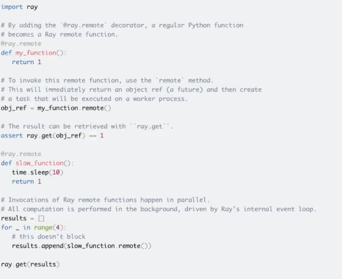
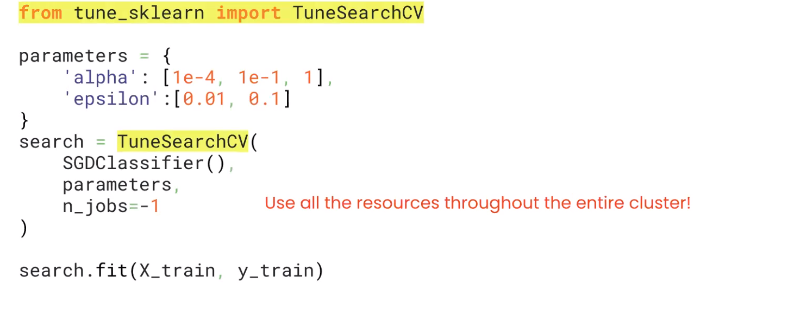
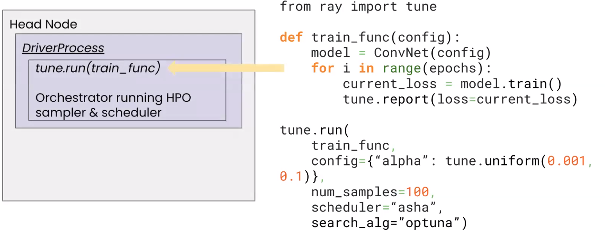

# Curring edge hyperparmeter tuning with Ray Tune

https://www.ray.io/

## What is Ray
* open-source project that enables scaling of compute-intensiv Python workload via distributed execution fraework
* has data-processing, training and serving capabilities

## What is Ray Tune

* Ray Tune is a distributed hyperparemeter optimization for Python, C++, 
* scikit-learn wrapper
* can be run on single machine, cluster or cloud without code changes
* auto-scaling and fault-tolerant, so saves time during hyperparm tuning
* unified API
* allows custom optimisation techniques
* Function >> Task
    * create a Ray task from function with `@ray.remote` dectorator
* Class >> Actor

## Challenges

* computationally heavy due to combinations, can take days

## HPO algorithms

* Ray Tune provides efficient algos to trial (>15)
    * Exhaustive (grid) / Random search
    * Bayesian Optimisation - uses results from previous combinations to decide which trial to try next. Inherently sequential, e.g. `HyperOpt, Optuna, Scikit-Optimize`
* Advanced scheduling 
    * early stopping - use results to prune underprerforming trials (`Median stopping, Hyperband, ASHA`)
    * Population Based Training - like a Genetic Algorithm for selecting hyperparams, terminate poor perfomers, mutate best performing
* Advanced sampling
    * `BlendSearch`: takes into account the execution time of combinations, progressively tryin gmore expensive ones (e.g. start with small number of XGB trees)
    * `Heteroscedastic Evolutionary Bayesian Optimisation` combiens Bayesian optimisation with evolutionary algorithms
    * `BOHB` combines Bayesian optimisation with HyperBand, making informed decisions on partial results 
* Orchestrates running distributed trials

## Architecture of Ray
* Master-worker architecture that centralizes decision making
    * **Sampler** provides combinations to evaluate
    * **Scheduler** determines which trials to start, pause, stop
    * **Elastiscity** and **Fault Tolerance**

## Using Ray
* Create train function with any library
    * `tune-sklearn`: scikit-learn  wrapper module https://github.com/ray-project/tune-sklearn
    
* Define sampling, scheduling, optimizer algo

* Ray launches worker nodes that execute trials and reports back to Master/Orchestraor node
* In event of crash, loads checkpoint and continues on
* Callbacks available for integration with `mlflow`

