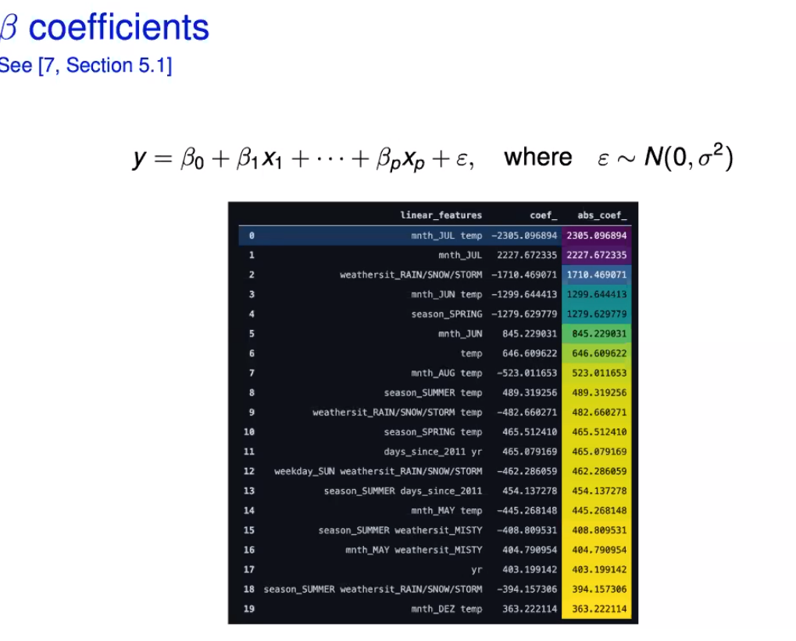
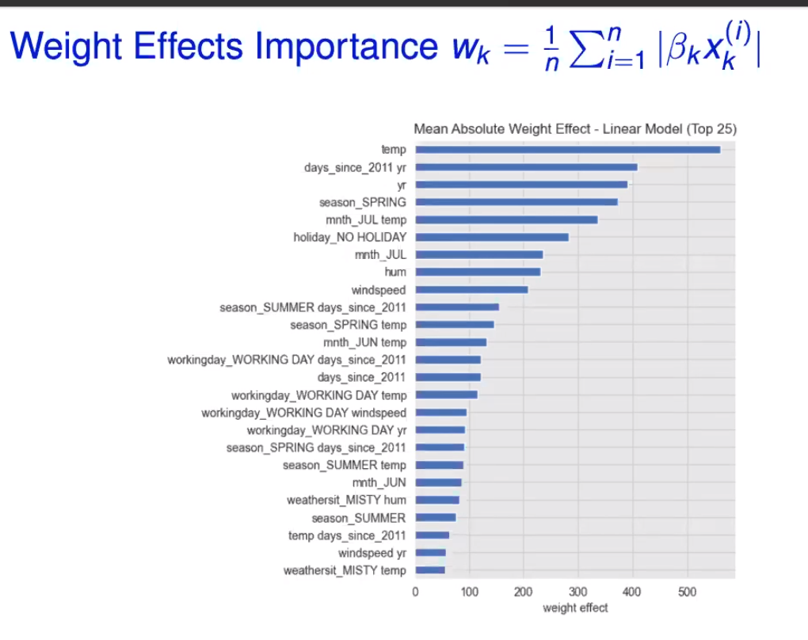
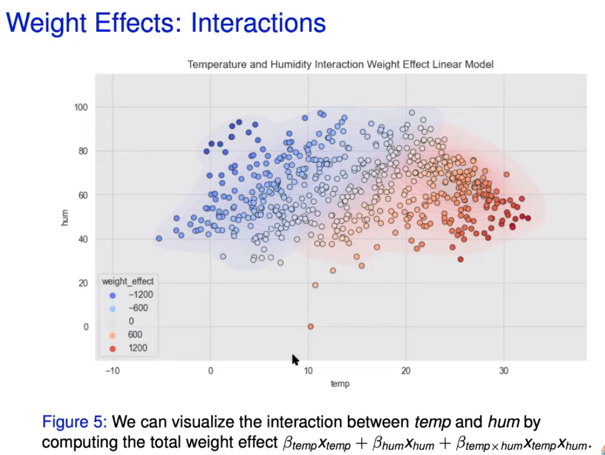
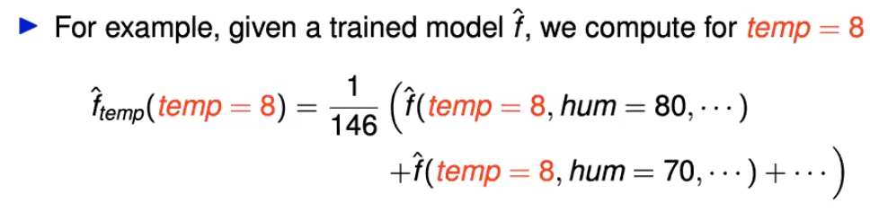
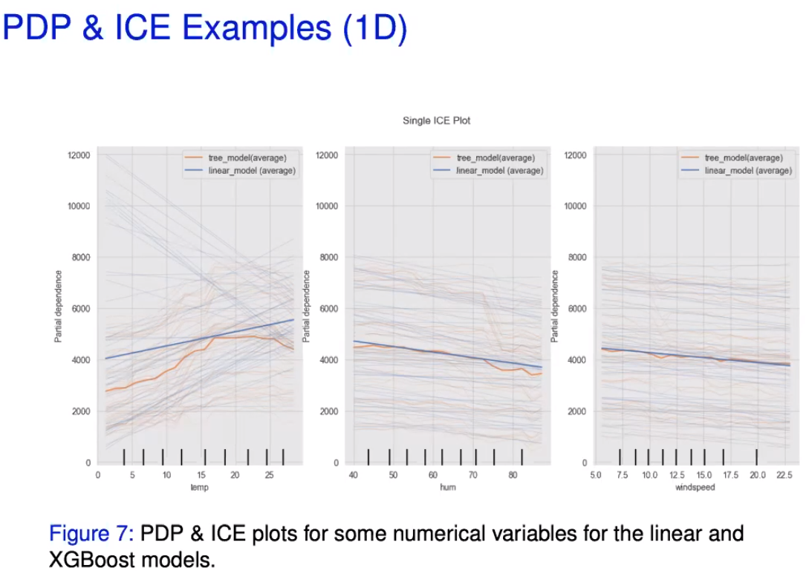
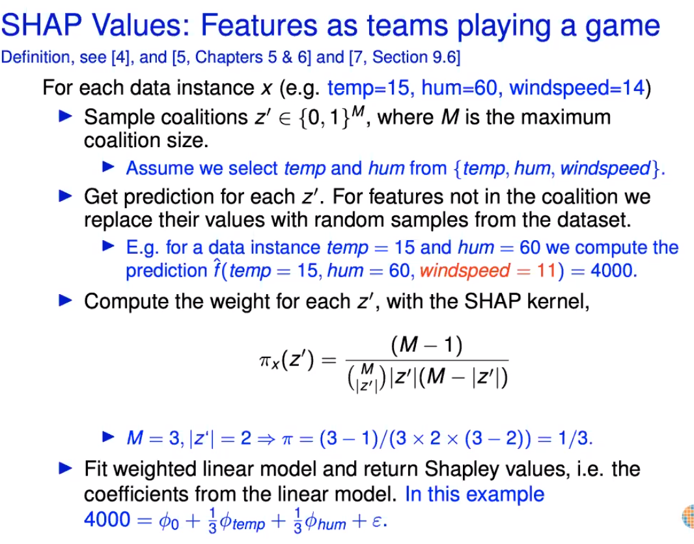
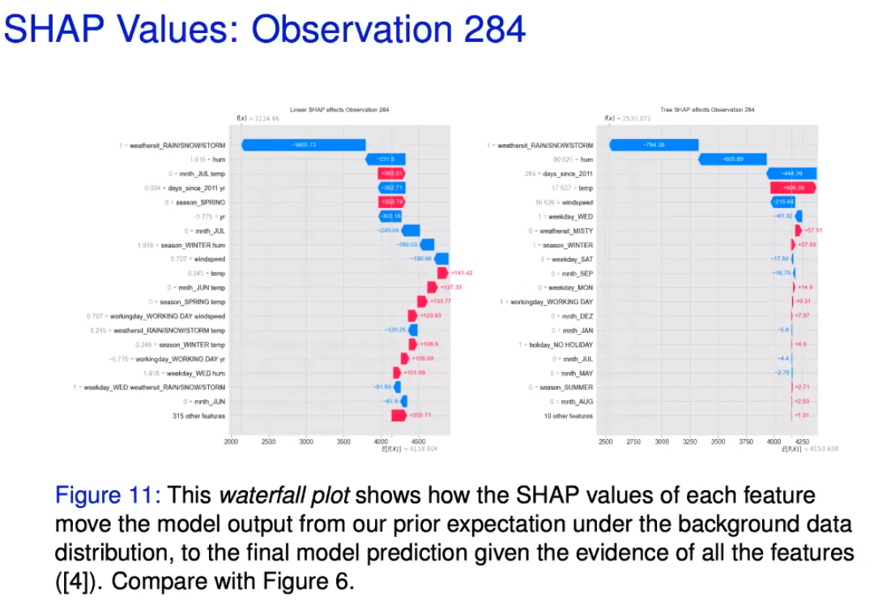

# Exploring tools for Interpretable Machine Learning

* Blog post: https://juanitorduz.github.io/interpretable_ml/
* slides: pydata2021\interpretable ML tools.pdf

## Interpreting ML models and how features interact with each other
* Illustrate via a use case - daily bike rental volumes over time
* Compare XGB vs Linear Model with second order interactions

**IMPORTANT!!**

* Domain knownledge
* understand input data
* understand logic behind the ML algorithm
* interpretability != causality

## Linear model feature importance
* Coefficients
    * numeric features were scaled
    * magnitude and direction of features can shed light on feature interactions
    
* Weight effects on model: `coefficient * feature value` captures distribution of all samples by feature.        
    * Taking the absolute mean of these values gives Weght Effects importance by feature: 
    
    * Scatter plot of weight effects for 2 features shows interaction effect on model
    

## XGBoost feature importance
* Gain: improvement in accuracy brought by a feature to the branches it is on 
* Cover: measures the relative quantity of observations concerned by a feature
* Frequiency / weight: counts the number of times a feature is used in all generated trees

## Partial dependence plots
* PDP shows the marginal effect one or two features have on the predicted outcome of the model
    * Take the average of prediction holding specific variable fixed, and repeat for a range of values
    

## Individual conditional expectation plot
* ICE shows one line per instance 
* PDP is the average of the lines of an ICE
* **PDP and ICE can be misleading in the presence of highly correlated variables (e.g. temperature and month) - so present together with correlation matrix**

## Permutation importance
* Intuition: if a feature is important, when we shuffle the feature values, the prediction error must increase, else it is not so important
* Presence of correlated variables can also make this measure spurious because it tests combinations that are not relevant

## Shapley values
* Features are teams playing a game
* Repeat over all combinations of coalitions
* Shapley values are the coefficients, phi

* Shap values represent the effect that features have on the average (prior) prediction, based on the entire data set

