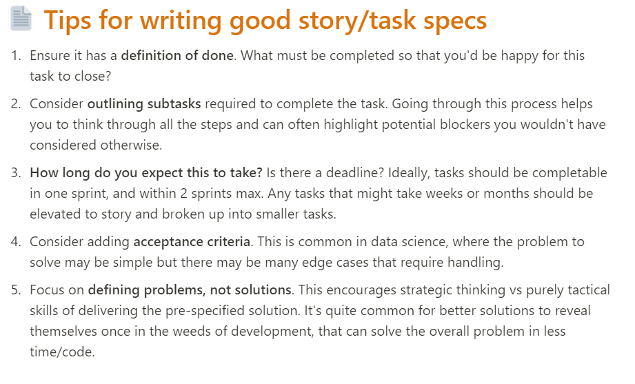

# AGILE DATA SCIENCE: HOW TO IMPLEMENT AGILE WORKFLOWS FOR ANALYTICS & MACHINE LEARNING

* https://bit.ly/pydata-agile
* Reference: The Phoenx Proejct - Novel about IT, Devotps and Helping your Bisness Win. Gene Kim

## Sprint lookahead
* every other week that is not sprint planning
* schedule important but not urgent yet
* plan for next iteration and beyond

## Cost of spending more time
* if we spent a sprint optimising model and got a 5% increase in accuracy, is it worthwhile to spend another sprint?

## Planning and Estimation
* consider relative estimates - Developers estimate effort points (not time) of Fibonnaci (1, 2, 3, 5, 8, 13) Small to XXXL
* Stakeholders/project lead estimate value points
* calculate value per effort score, rank order to rank stories - prioritise high impact work
* IT WILL ALWAYS TAKE LONGER THAN YOU THINK

## Practical tips
* stories can rollover. Discuss why it was underestimated. Claim points in next sprint
* use "spikes" - fixed time-boxed windows to investigate stories that cannot be estimated . e.g. 3 hour spike, to help estimate
* Quarterly epics

## Q&A (Slack)
>Are MLOps examples ideally suited to agile vs more experimental ML/research work?

You're right, not overplanning is important! You likely have an "ML research playbook" (even if it's only in your own mind) of ideas to try, directions to go in, but you need to know the outcome of experiment #1 before you can even decide what experiment #2 should be.

In this scenario, break things down to the level where it's sensible/plausible to do so, and otherwise it's fine to have it as eg. a 13 point story on your board.

 It's unlikely everyone on your team is working on this one thing. As you discover/learn what works in your model experiments, you can keep the team updated through your PM software. If you have your CI configured to run your model evaluation (e.g. using DVC, Neptune, W&B) then it can even auto-update your tickets with the latest experimental results. This focus on automation means less time spent updating stakeholders, way less time spent in meetings managing the work, and more time spent experimenting.

Finally, I think the time-limited sprint idea is possibly the most useful concept for ML development. It forces a checkpoint with working iterations where you can track your model's best scores to date. Your stakeholders can see this, and decide where to best utilise your time and skills to *maximise business ROI*. Example:
* Sprint 1: model prototype is hitting 75% F1 score with 10 days FTE invested
* Sprint 2: model v1 is hitting 78% F1 score with another 8 days FTE invested.
* Sprint 3: model v2 is at 80% F1 score (5 days FTE invested)
* Sprint 4: with your analytical help, you agree with the CEO that even 1% of additional F1 is worth £500k to the business per annum. So the CEO puts the whole on further development for this sprint, and you hit 85% F1 score with 20 days FTE invested.

