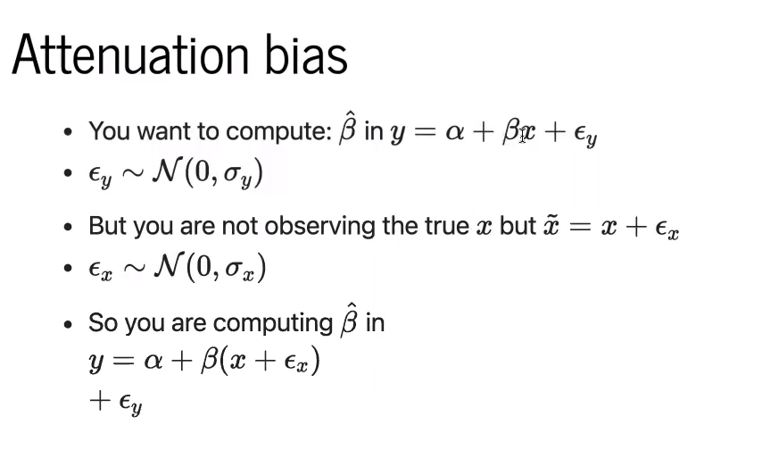

# SOME ATTENTION FOR ATTENUATION BIAS

## Bias in this context
* computing something different than you intended
* **Attenuation bias = Measurement Error Bias == Regression Dilution**
    * Attenuation bias always tends towards bias
 
* Need to be aware of potential attenuation bias when:
    * may be noise in observed x
    * you care about **what happens to y when true x changes**
    * you're doing inference, rather than plain prediction/classification
* How to tell if you're doing inference

## How to account for attenuation bias
* Deming REgression, Orthogonal (Distance) Regression (ODR), Total Least Squares (TLS)
* Error-in-Variables models - flexible Bayesian version using latent varibles
    * sensitive to model specification, could still be bias
* Presenter's proposed solution for binary x (treatment)
     * instead of using 1/0 for treatment value, apply p(x), e.g. 0.85/0.15m