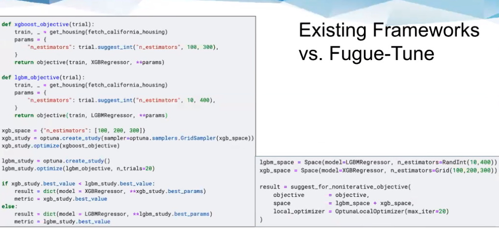

# FUGUE TUNE: A SIMPLE INTERFACE FOR DISTRIBUTED HYPERPARMETER OPTIMIZATION

* `pip install tune[hyperopt,sklearn]`
* https://github.com/fugue-project/tune
* Space Operation Demo:
https://www.kaggle.com/liujun4/tune-demo-1-space-operation
* Greykite Demo:
https://www.kaggle.com/liujun4/tune-demo-2-general-ml-objective-tuning-greykite
* sklearn Demo: https://www.kaggle.com/goodwanghan/tune-tutorials-2-non-iterative-problems

## What is Fugue Tune
* Tune is part of Fugue framekwork - run on various computation backend (Spark, Dask, local)
* An abstraction layer for hyperparm tuning. Integrates existing frameworkds e.g. `Optuna, Hyperopt`
    * lower level APIs do not assume the objective is a machine learning model
    * higher level APIs are dedicated to solve specific problems, such as Scikit-Learn compatible model tuning and Keras model tuning
* Framework and Method agnostic
    * Use with any ML framework
    * Search on Hybrid Space
    * Switch between libraries like Hyperopt and Optuna without code change
* Scalable and automated
    * Tune both locally and distributedly without code change
* Platform agnostic
    * Works for backends such as Spark, Dask and local


## Fugue Tune vs existing options

* Takes any python function as the `objective` function
* Easily supports multiple metrics
* Note that Schema is enforced in Fugue, which forces more explicit and descriptive code.

## Hybrid search space >> less code
* Tune supports hybrid search space, thus reducing code required. Search space is defined using unified method and can be different for different parameters. e.g. 
```python
rand_space = Space(a = Rand(1, 2)).sample(2)

grid_space = Space(b = Grid("x", "y"))

bo_space = Space(c = Rand(2, 3))

space = (rand_space + grid_space) * bo_space # union of search space applies Bayesian optimization as a second tuning layer on top of Random and Grid Search. Effectively takes cross-product of param options
```

## Distributed Hyperparam Tuning
* simply add `execution_engine` parameter to use Spark, Dask etc