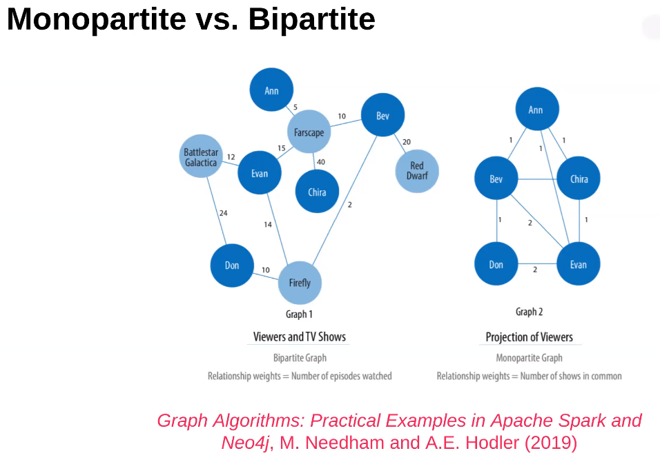
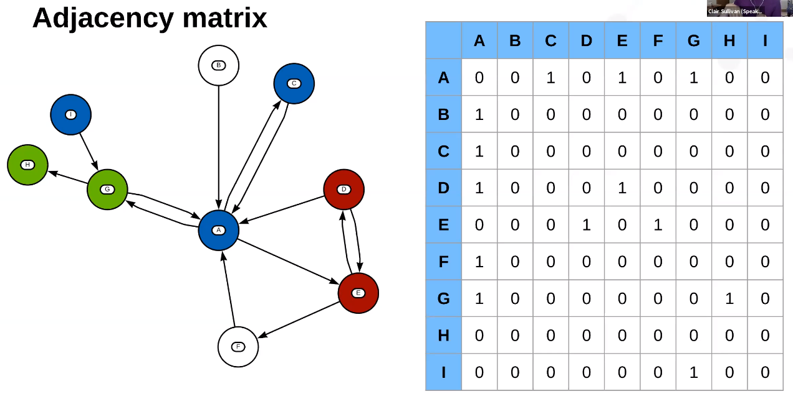
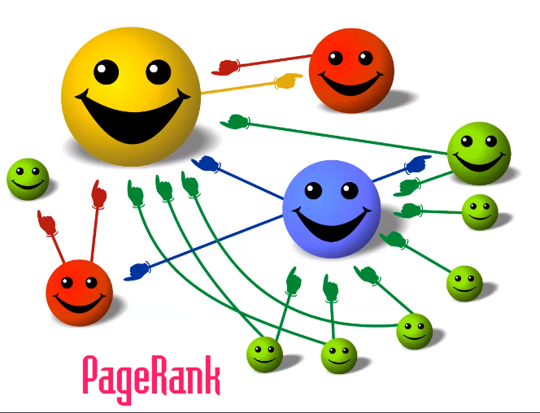
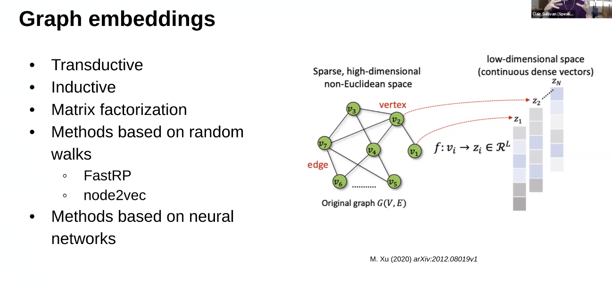

# Workshop: WORKING WITH DATA IN A CONNECTED WORLD: THE POWER OF GRAPH DATA SCIENCE

* Tutorial
    * https://github.com/cj2001/pydata2021/
    * https://sandbox.neo4j.com/

* References: 
    * https://github.com/cj2001/pydata2021#some-helfpul-resources
    * Graph Algos: Practical Examples in Apache Spark and Neo4j, Needha amdn Hodler (2019)
    * Bite sized Neo4j Youtube Series

Key points
1. It can be good to break the assumption that individual data points are independent
2. Modelling relationship can result in models that are less noisy and more accurate

## Graph theory crash course
* What is a graph? 
    * things connected to other things
* Common examples
    * recommendation systems
    * search
    * knowledge graphs, Q&A    
* E.g. 1: Churn - what if the customers are related? If one leaves, the other related party may be more likely to leave
* E.g. 2: Recommendation engine - graphs can represent relationships between customers
* Directed vs Undirected vs Weighted graph
    * Facebook relantionships are undirected
    * Twitter follow is directed
    * Weighted indicates strenght of connection between nodes
* Monopartite vs Bipartite
    * Relates to how many different node types in a graph (Bipartite on left Monopartite on right)
    
* Graphs can be transformed into matrices
    * Adjacency
    
    * Degree (number of relationships in and out)
    * Node importance (centrality algoritms - Degree, Betweenness, PageRank)
    
* Community detection (subgraphs)    
* Graph embeddings
    * Goal: convert high dimensional sparse non-Eucliedean space into low-dimensional dense vectors
    * Transductive: retrain embeddings with each new node inserted in graph
    * Inductive: do not retrain when adding nodes

    * Graph embeddings can then be used in regular ML models + ones unique to graphs e.g. link prediction (how likely are 2 nodes related?), (sub)graph-level structural similarity (e.g. identifying similar genes in DNA structure)
        * Graph embeddings take into account the relationships between embeddings

## How do I know if I have a "graph-y" problem?
* If you have >2 joins, suspect you have a graph-y problem
* Nodes are quite tightly connected
* Images can be represented as a graph - pixels related to other pixels

## Loading data into a graph database
* Best to have 1 file for edges, 1 for nodes. If >1 type of relationship, have 1 file for each type
    * Cora data set example: 
        * nodes (academic papers, bag of words features): `subject, features, id`
        * edges (citations): `target, source, label`
        * 7 different classes (multi-class) - paper types
        * `inDegree` - number of citations
        * Graph traversal: find nodes within 3 hops of a node
        ```python
        query = """
        MATCH (p1:Paper {id: '114'})<-[*1..3]-(p2:Paper)
        RETURN p2.id AS id, p2.subject AS source_subject, p1.subject AS target_subject
        LIMIT 5
        """
        ```

## neo4j
* one of many graph data bases
* native query language is `cypher`       

## demo
1. Clone https://github.com/cj2001/pydata2021/
2. In neo4j https://sandbox.neo4j.com/ 
    * create blank sandbox in neo4j
    * using code in  `populate_cora_db.cql`, execute snippets to
        * load node and edge data from github repo
        * Create in-memory graph
        * Create graph embeddings with FastRP 
3. view sample in neo4j of graph with `MATCH (n) RETURN n`
4. In Google Colab, paste in uri (Bolt URL) and password from nodej4 into notebooks and run analysis:
    * `notebooks/intro_to_cypher.ipynb` runs EDA
    * `notebooks/cora_word_embs.ipynb` runs linear SVM on bag of words embeddings
    * `notebooks/cora_graph_embs.ipynb` creates graph embeddings
    * `notebooks/cora_tune_embs.ipynb` tunes hyperparams with `optuna` 


