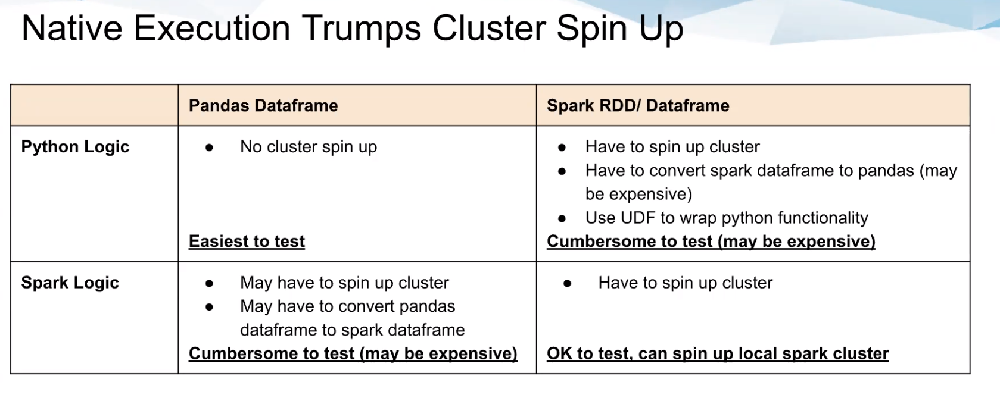
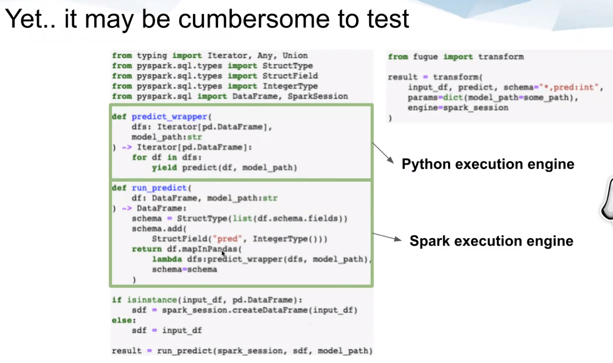
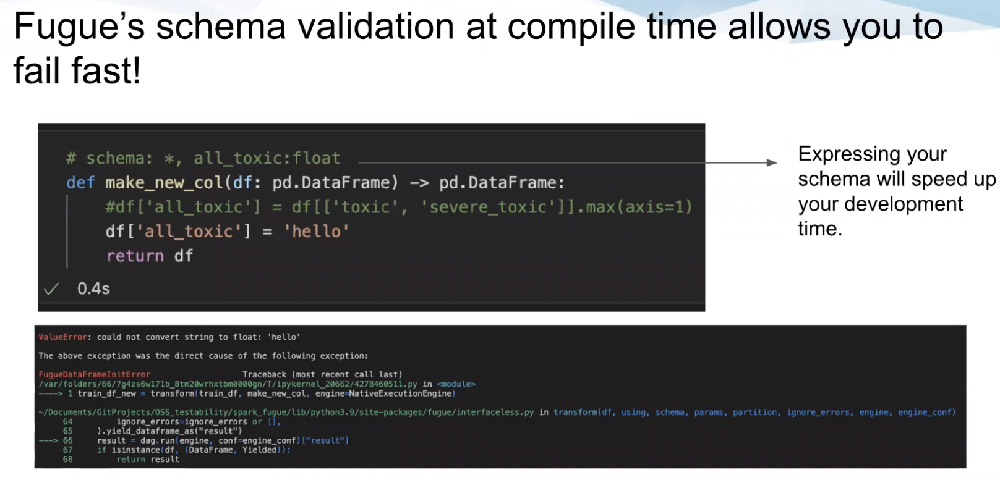

# SIMPLIFYING TESTING OF SPARK APPLICATIONS WITH FUGUE

* https://github.com/gityow/pydataglobal2021
* Demo: https://github.com/gityow/pydataglobal2021/blob/main/fugue_tokenize.ipynb

* Use Fugue, an abstraction layer that enables us to test code in a Pandas environment before executing it on Spark
* Besides explicitly specifying schema of input and output, does not require re-write
    * Easier compared to Pyspark, which is not Python native and executes on Java Virtual Machine

## Switching execution engines
* Native python: `transform(df, ..., engine=NativeExecutionEngine)`
* Spark: `transform(df, ..., engine=SparkExecutionEngine)`
* Dask: `transform(df, ..., engine=DaskExecutionEngine)`

## Fugue circumvents testing challenges (e.g. Python UDFs) where there is interaction between Spark and Pandas
* Enables users to keep their native Python logic for Spark testable
* No need for cluster spin up unless warranted
* Consistency between Python and Spark behaviour e.g. nulls in joins

## Fugue does schema validation at compile time
* Fugue requires explicit declaration of schema
 
