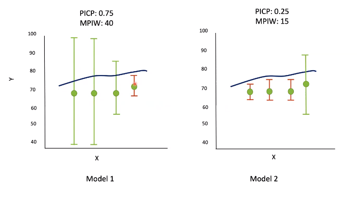

# UNCERTAINTY QUANTIFICATION 360: A HANDS-ON TUTORIAL

* A Python toolkit that provides a broad range of capabilities for quantifying, evaluating, improving, and communicating uncertainty in the AI application development lifecycle.
* Webpage: https://uq360.mybluemix.net/
* Github: https://github.com/IBM/UQ360

## What is uncertainty quantification?
* AI model capability to say "I am unsure"
* Data uncertainty = Aleatoric uncertainty
* Model uncertainty = Epistemic Uncertainty

## Metrics for assessing quality of model uncertainty 
* Classification: Reliability plot - confidence score vs accuracy (calibration)

* Classification: risk vs rejection plot
* Regression: Prediction Interval Coverage Probability (PCIP) / Miss Rate
    * compares prediction interval overlap with ground truth for all instances. 
    * reflects proportion of observations where overlap exists (higher is better, max = 1)
* Regression: Mean prediction Interval Width (MPIW)
    * average uncertainty - lower is more certain

* Uncertainty characteristic curve

## Uncertainty quantification algorithms
* intrinsic to ML algorithm (well calibrated outputs)
* post-hoc on model outputs to improve prediction calibration
