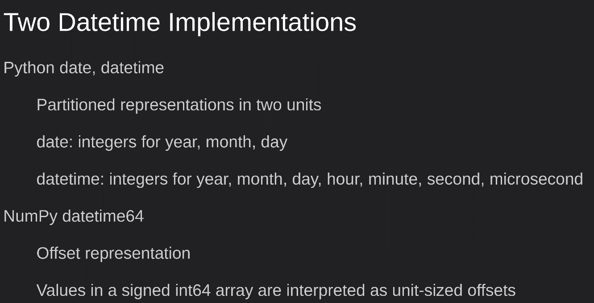
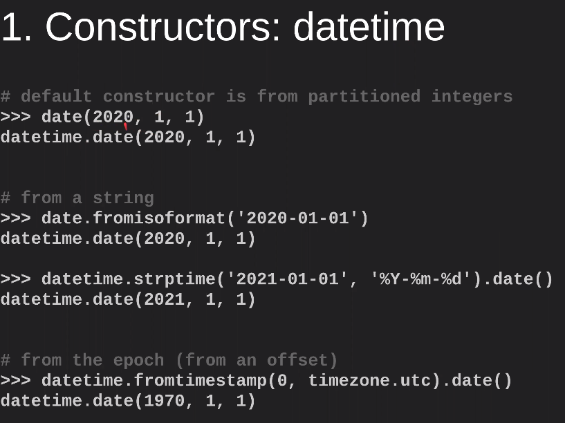
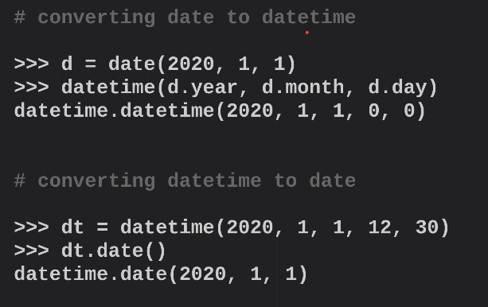
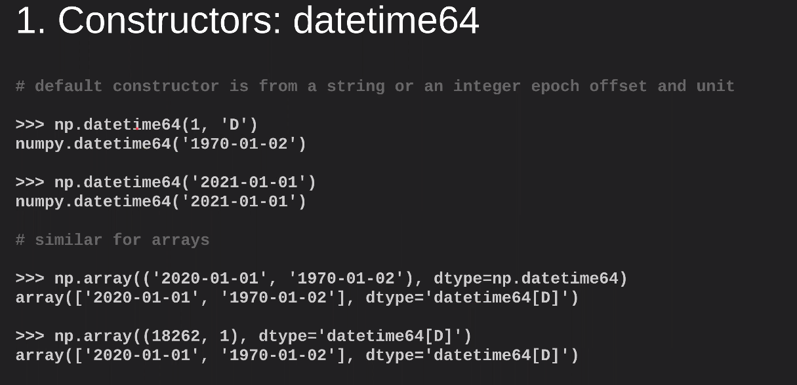
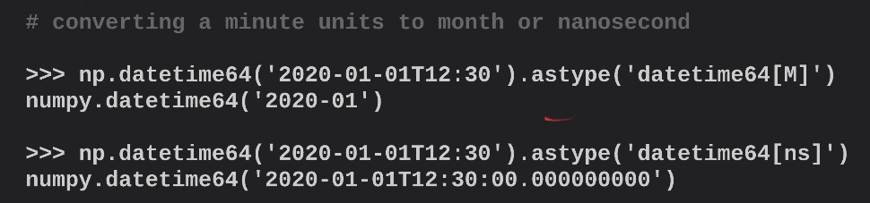
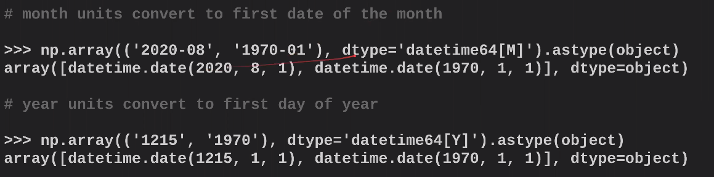
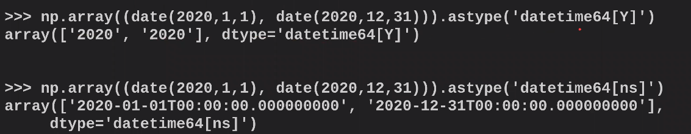

# WHY DATETIMES NEED UNITS: AVOIDING A Y2262 PROBLEM & HARNESSING THE POWER OF NUMPY’S DATETIME64

* `StaticFrame` data frame library with imutable data
* Key message: use Numpy `datetime64` for maximum control over units in which you wish to define the date (with Pandas `datetime`, everything is in nanoseconds). Also provides greater range in dates and faster processing. 

## Motivation
* confusion between NumPy datetime64, Pandas timestamp, Pandas datetme
* Y2262 problem in Pandas: casued by the the exclusive use of nanoseconds for all datetime64
```python
pd.DatetimeIndex(('2262-04-11')) + pd.Timedelta(days=1)
# will raise an overflow in int64 addition
```

## Why Datetimes need Units
* Main representations:
    * partitioned: year, month, day ..
    * offset from anchor e.g. Unix epoch 1970-01-01T00:00:00

## Comparing Datetime and Datetime64    

* Pandas datetime:     
    * broad support for parsing strings and other representations
    * each type defined as a single unit (date, datetime)
        * data resolution may noto be the same as the unit (e.g. micro seconds when most granular is day)
            
    * converting between types - need to create a new object using constructor  
    
    * shifting dates cannot use an integer, must use `timedelta()`
    * missing values: `None`
    * uses nanoseconds resolution by default
    
* Numpy datetime64: 
    * can provide an offset (as an integer) and a unit
    * narrow support for string representations
    * can create datetime64 elements or datetime64 arrays
    * one type supports 13 units from year to attosecond
        * data resolution can be the same as the unit
            
    * converting between types uses `astype()` method
    
    * supports shifting by an integer because unit is captured in the type of object
    * missing values: `None or ''` represented as `NaT` which can live in datetime64 arrays
    * faster dealing with datetime64 arrays

* Pandas Timestamp
    * datetime sublcass with nanosecond resolution
    * permits conversion of nanosecond arrays to eelements and object arrays    

## Converting between datetime64 and datetime
* datetime64 to datetime
    * converting datetime64 with anything less granular than date (month, year) will return a date 
    
    * every datetime64 is at nanosecond resolution
* datetime to datetime64
    * safer, just use `astype()`
    